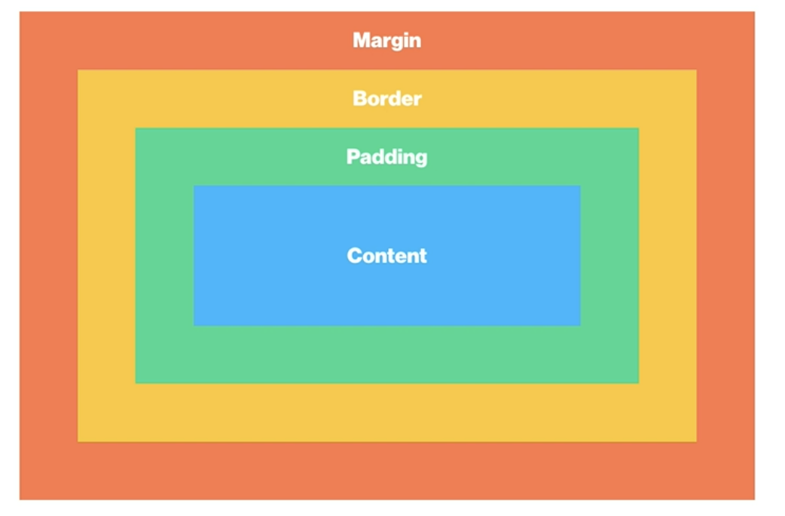

Css
==========

# Box

 ### Box Model

  
1. Content  
가로는 Width, 세로는 height

2. Padding  
안쪽 여백, 즉 Content와 border 사이의 공간을 나타내는 padding  
ex) padding-left: 30px;

3. Border  
테두리를 나타내는 border  
ex) border: 1px solid #000;, 굵기 스타일 색상  
border-radius: 숫자값;  
border를 동그랗게 하고싶을땐 50%를 주면된다.  
top left를 이용하여 개별적으로도 줄수있다.

4. Margin  
바깥 여백, 즉 요소와 요소 사이의 간격을 나타내는 margin  

5. 속기형(Shorthand)  
시계방향만 기억하면 된다.
ex) padding: top right bottom left
(top, bottom) (right, left) 셋트라서 
    ex) padding: 20px 40px 이렇게만 줘도 bottom, left 가 알아서 따라간다.

 ### Box Sizing  
- content에 width와 height로 box 크기를 지정하게되면  
content에만 적용이 되어 우리가 생각하는 크기와 다르게된다.  
ex) box-sizing: border-box 로 변경해줘야  
내가 생각하는 만큼 크기를 줄수있다.  

 ### Box Type
 1. block    
    - 따로 width를 선언하지 않은 경우, width = 부모의 content-box의 100%  
    - 따로 width를 선언한 경우, 남은 공간은 margin으로 자동으로 채움  
    - margin: 0 auto; auto라는 속성은 자동으로 채워지는 margin값을 어느쪽으로 줄거냐라는 뜻이다.  
    - 따로 부모의 height를 선언하지 않을 경우, __자식 요소의 height의 합 = 부모의 height__  
    - width, height, padding, border, margin 다 사용할 수 있다.
2. Inline
    - width, height, padding-top, padding-bottom, border-top, border-bottom, margin-top, margin-bottom 사용불가 왜냐하면 inline흐름에서 박살내버리는 속성들이라 그럼.
3. Inline Block
   - Inline에 Block의 능력을 탑재한 속성
   - Inline일때 못쓰는 property 속성들을 사용할 수 있다.

# Float
### Block 요소들을 가로배치를 하기위해서 사용
- 부모가 갖고있던 자식이 float가 되버리면 붕 뜨게된다. 붕 떠버린 공간을 나머지 자식들이 채우게된다.
- Inline, Inline-Block 요소들에게 float 속성을 주게되면 block으로 바뀌게 된다.
- float을 시키고 따로 width를 주지않으면 컨텐츠길이만큼만 늘어난다.
- __형제 요소가 있으면 레이아웃이 와장창 망가짐__
### Float 으로 망가진 레이아웃을 잡는 첫번째 방법
- float된 자식을 가진 부모에게 overflow: hidden을 주게되면 float된 자식을 알고있는다.
### Float 으로 망가진 레이아웃을 잡는 두번째 방법
- clear 속성 float으로 망가진 레이아웃을 잡기위해서 나온 속성  
-  형제요소중 float을 먹은 형제요소가 있다면 막내에게 clear속성을 주면 float된 형제의 위치를 알고있는다.
-  막내요소도 float을 먹고있으면 css를 이용해 가상요소를 만들어준다.(::before,  ::after) __clear속성은 block에게만 줄수있어 block으로 바꿔주어야 한다.__

# Position
   ### static
   - 가장 기본적인 모든 요소의 position은 static이다. default값  
   ### relative
   - 기준점은 자기자신이 본래있던 자리.  
   - top, left를 주게되면 flot을 주는것과 같이 붕 뜨게된다. 하지만 float처럼 주변  요소들에게 영향을 끼치지않는다. 자기자신과 부모, 형제들이 위치를 다 알고있기 때문에
   ### absolute
   - float먹인 상태와 같아진다 다른점은 주변 요소들이 감지를 못하기때문에 유아독존상태가 된다.
   - 자신을 감싸는 여러요소들중 기준점을 선택할 수 있다. 선택기준은 상위 부모들중 position이 static이 아닌것중에 선택됨.
   - 기준점 설정이 반드시 필요. 상위요소에서 만만한 relative를 사용.
   ### fixed
   - apsolute와 동일한 현상. 하지만 기준점이 다르다.
   - 하지만 자신의 기준점이 정확하게 정해져있다. viewport가 기준점이다.
   - 위치를 주면 항상 그위치에 고정되있다.
   ### z-index
   - position속성을 사용하고 위치를 주게되면 위로 붕 뜨는 현상이 발생한다. 붕 뜨는 높이를 조정할 수 있는 속성이다.
   - 정수 값을 사용한다.

   