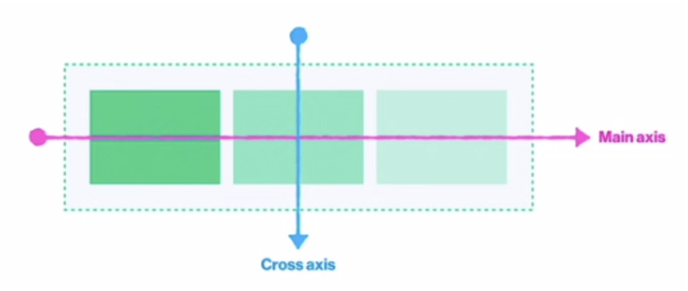
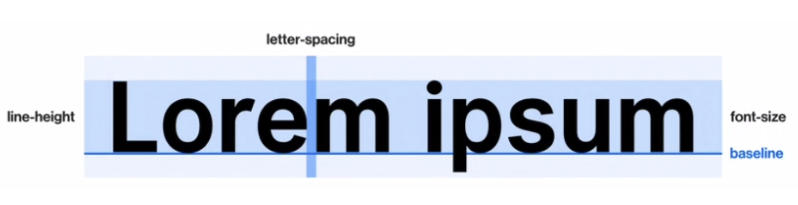

Css
==========

# <span style="color:skyblue;">Box</span>
1. Box Model
   
  
   * Content  
      가로는 Width, 세로는 height

   * Padding  
      안쪽 여백, 즉 Content와 border 사이의 공간을 나타내는 padding  
      ex) padding-left: 30px;

   * Border  
      테두리를 나타내는 border  
      ex) border: 1px solid #000;, 굵기 스타일 색상  
      border-radius: 숫자값;  
      border를 동그랗게 하고싶을땐 50%를 주면된다.  
      top left를 이용하여 개별적으로도 줄수있다.

   * Margin  
      바깥 여백, 즉 요소와 요소 사이의 간격을 나타내는 margin  

   * 속기형(Shorthand)  
      시계방향만 기억하면 된다.
      ex) padding: top right bottom left
      (top, bottom) (right, left) 셋트라서  
      ex) padding: 20px 40px 이렇게만 줘도 bottom, left 가 알아서 따라간다.

2. Box Sizing  
   * content에 width와 height로 box 크기를 지정하게되면  
   content에만 적용이 되어 우리가 생각하는 크기와 다르게된다.  
   ex) box-sizing: border-box 로 변경해줘야  
   내가 생각하는 만큼 크기를 줄수있다.  

3. Box Type
   1. block    
       - 따로 width를 선언하지 않은 경우, width = 부모의 content-box의 100%  
       - 따로 width를 선언한 경우, 남은 공간은 margin으로 자동으로 채움  
       - margin: 0 auto; auto라는 속성은 자동으로 채워지는 margin값을 어느쪽으로 줄거냐라는 뜻이다.  
       - 따로 부모의 height를 선언하지 않을 경우, __자식 요소의 height의 합 = 부모의 height__  
       - width, height, padding, border, margin 다 사용할 수 있다.
   2. Inline
      - width, height, padding-top, padding-bottom, border-top, border-bottom, margin-top, margin-bottom 사용불가 왜냐하면 inline흐름에서 박살내버리는 속성들이라 그럼.
   3. Inline Block
      - Inline에 Block의 능력을 탑재한 속성
      - Inline일때 못쓰는 property 속성들을 사용할 수 있다.

# <span style="color:skyblue;">Float</span>
   1. Block 요소들을 가로배치를 하기위해서 사용  
      * 부모가 갖고있던 자식이 float가 되버리면 붕 뜨게된다. 붕 떠버린 공간을 나머지 자식들이 채우게된다.
      * Inline, Inline-Block 요소들에게 float 속성을 주게되면 block으로 바뀌게 된다.
      * float을 시키고 따로 width를 주지않으면 컨텐츠길이만큼만 늘어난다.
      * __형제 요소가 있으면 레이아웃이 와장창 망가짐__
   
   2. Float 으로 망가진 레이아웃을 잡는 첫번째 방법
      * float된 자식을 가진 부모에게 overflow: hidden을 주게되면 float된 자식을 알고있는다.
   3. Float 으로 망가진 레이아웃을 잡는 두번째 방법
      * clear 속성 float으로 망가진 레이아웃을 잡기위해서 나온 속성  
      *  형제요소중 float을 먹은 형제요소가 있다면 막내에게 clear속성을 주면 float된 형제의 위치를 알고있는다.
      * 막내요소도 float을 먹고있으면 css를 이용해 가상요소를 만들어준다.(::before,  ::after) __clear속성은 block에게만 줄수있어 block으로 바꿔주어야 한다.__

# <span style="color:skyblue;">Position</span>
   1. static
      * 가장 기본적인 모든 요소의 position은 static이다. default값  
   2. relative
      * 기준점은 자기자신이 본래있던 자리.  
      * top, left를 주게되면 flot을 주는것과 같이 붕 뜨게된다. 하지만 float처럼 주변  요소들에게 영향을 끼치지않는다. 자기자신과 부모, 형제들이 위치를 다 알고있기 때문에
   3. absolute
      * float먹인 상태와 같아진다 다른점은 주변 요소들이 감지를 못하기때문에 유아독존상태가 된다.
      * 자신을 감싸는 여러요소들중 기준점을 선택할 수 있다. 선택기준은 상위 부모들중 position이 static이 아닌것중에 선택됨.
      * 기준점 설정이 반드시 필요. 상위요소에서 만만한 relative를 사용.
   4. fixed
      * apsolute와 동일한 현상. 하지만 기준점이 다르다.
      * 하지만 자신의 기준점이 정확하게 정해져있다. viewport가 기준점이다.
      * 위치를 주면 항상 그위치에 고정되있다.
   5. z-index
      * position속성을 사용하고 위치를 주게되면 위로 붕 뜨는 현상이 발생한다. 붕 뜨는 높이를 조정할 수 있는 속성이다.
      * 정수 값을 사용한다.

# <span style="color:skyblue;">Flex</span>
   1. flex를 선언하게 되면 두개의 Axis(축)이 생긴다.
   2. 정렬을 하고싶은 부모에게 display: flex를 준다
   3. 가로정렬, 세로정렬을 할 것 인지 알려줘야 한다. flex-direction
      * 가로방향 row, row-reverse
      * 세로방향 column, column-reverse
      * flex-direction이 어떤값이냐에 따라 Axis(축)이 달라진다.  
      flex-direction: row; 일때의 Axis(축) main axis가 direction의 방향  
      cross axis는 main axis의 방향에따라 수직,수평 방향
      
      * main axis로 정렬을 하려면 justify-content로 위치정렬
      * cross axis로 정렬을 하려면 align-items, align-content로 위치정렬
   4. flex-wrap 한줄로 정렬해버리는 nowrap, 여러줄을 만들어 정렬 wrap
   5. order를 통해 자식요소들의 순서도 바꿀수 있다.


# <span style="color:skyblue;">Midea Query</span>
   1. HTML viewport meta태그 반드시 필요.
   2. @media screen and (min-width: 768px) screen이 최소 768이상에서는
   3. min은 이상, max는 이하
   4. 모바일 환경에 맞춰 먼저 작업을 해놓고 media쿼리로 테블릿, 데스크탑 작업해야 편하다.

# <span style="color:skyblue;">Typograpy</span>

   1. 텍스트를 이쁘게 디자인한다 라는 뜻
   
   2. px
      * 절대단위
   3. em, rem
      * 상대단위
         1. em : 실제로 적용된 폰트사이즈를 1em으로 본다. ex) font-size: 20px = 1em은 20px
         2. rem : HTML에 적용된 폰트사이즈를 1rem으로 본다.
   4. line-height 줄간격을 뜻한다.
      * px, em, rem 을 사용할 수 있다. 주로 em을 많이 사용함.
   5. letter-spacing 글자와 글자사이의 자간을 뜻한다.
      * px, em을 사용할 수 있다.
   6. font-family 서체를 뜻한다.
   7. font-weight 폰트의 굵기를 뜻한다. 무조건 100 단위로 먹는다.
   8. color 글씨의 색상
   9. text-align 글자 정렬
   10. text-indent 들여쓰기 속성
   11. text-transform 알파벳에만 적용됨 소문자를 대문자로..등등 변화주는 옵션
   12. text-decoration 글자에 줄긋는 속성
   13. font-style 글자를 기울일때 쓰는 속성 italic
   
# <span style="color:skyblue;">Background</span>

   1. background-color 배경색을 지정하는 속성
   2. background-image url을통해 image 경로를 지정
   3. background-repeat 이미지 반복을 원하지않을때 설정
   4. background-size 이미지의 사이즈 지정
   5. background-position : x축 y축 위치 설정

# <span style="color:skyblue;">Transition</span>

   1. 어떤 요소를 스르륵 바뀌게 하는 것
   2. property Css 속성을 명시
   3. duration 지속시간을 명시 ms, s 시간설정
   4. timing-function 변화의 속도 지정 (생략가능)
      * ease-in: 처음엔 천천히 나중엔 휙
      * ease-out: 처음엔 흭 나중엔 천천히
      * ease-in-out: 짬뽕
      * cubic-bezier: 속도를 직접 제어하고싶을때
   5. delay 이벤트 시작 지연 설정 (생략가능)
   ```css
      선택자 {
         transition: property속성 duration지속시간 timing-function delay;
         transition: font-size 1000ms ease-in 1000ms;
      }
   ```

# <span style="color:skyblue;">Animation</span>

   1. @keyframes name 을 꼭 사용하여 어떤 애니메이션을 줄것인지 명시
      ```css
         @keyframes name {
            from {
               시작할떼
            }

            to {
               마지막엔 이렇게 바껴라
            }
         }

         @keyframes name {
            0% {
               처음
            }

            50% {
               중간
            }

            100% {
               마지막
            }
         }
      ```
   2. duration 지속시간을 명시 ms, s 시간설정
   3. timing-function transition과 동일
   4. delay transition과 동일
   5. iteration-count 애니메이션을 몇번 재생할것인지 계속하고싶을땐 infinite
   6. direction 어떤 방향으로 진행될지
      * from~to가 진행방향 reverse를 주면 반대로
      * alternate주면 번갈아가면서 진행
   7. ```css
      .box {
         animation-name: move-box;
         animation-duration: 1000ms;
         animation-delay: 1000ms;
         animation-timing-function: ease-in;
         animation-iteration-count: infinite;
         animation-direction: alternate;
      }

      @keyframes move-box {
         from {
            top: 0px;
            background-color: #0066ff;
         }

         to {
            top: 200px;
            background-color: #ff4949;
         }
      }
      ```
# <span style="color:skyblue;">Etc</span>

   1. Box Shadow 박스에 그림자를 주는것
      * box-shadow: x축이동 y축이동 흐린정도 그림자사이즈 색상(neomorphism box shadow구글링 참고)
   2. Opacity 투명도에 관한 속성 ( 0 ~ 1 )
   3. Overflow 자식요소들이 부모의 크기를 벗어날때 설정하는 속성
      * visivle: 기본값 그냥 내비둬라
      * auto, scroll 넘치는 애들은 스크롤 하라는 옵션
      * hidden 넘쳐흐르는 애들은 가려버리라는 옵션
      * overflow-x, overflow-y 이용해 각각 줄수도있다.
   4. transform 요소를 2차원 3차원 공간에서 변형시키는 속성 함수가 엄청많음
      * translate(x, y) 요소를 원하는 위치로 이동시키고 싶을때  
      (원래의 위치를 기억하고있기 때문에 다른요소들에게 영향을안줌)  
      위치 기준은 자기자신 width, height
      * scale(N) 숫자의 배율 만큼 사이즈를 조절
      * rotate(Ndeg) 요소의 각도를 돌리는 함수 ex)rotate(90deg)
   5. visibility 보여줄건지 말건지 하는 속성
      * visible 기본값 보여지는 옵션
      * hidden 안보여주는 옵션 


# <span style="color:skyblue;">Selector</span>

   1. 자식 선택자
      * 부모 > 자식
   2. 자손 선택자
      * 부모 자손
   3. 형제 선택자들
      * 자기자신 ~ 뒤에있는형제들
      * 자기자신 + 다음형제 (한형제만 가능) 
   4. 구조적 가상 클래스 선택자
      * 선택자:first-child (li:first-child) 첫번째 li
      * 선택자:last-child
      * 선택자:nth-child(선택요소) (li:nth-child(3)) 세번째 li
   5. 선택자 우선순위: 1등 아이디, 2등 클래스, 가상클래스, 3등 요소선택자


